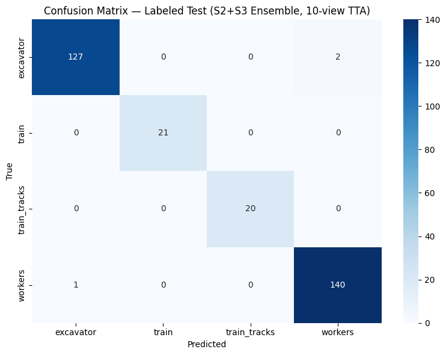
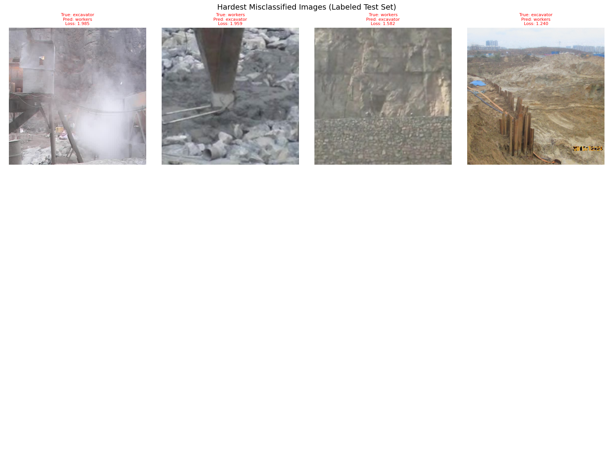

# Railway Object Detection — 1st Place Solution

**Kaggle competition:** 4-class railway scene classification[Link](https://www.kaggle.com/competitions/i-ilia-029-lab-05-cnn-transfer-learning-for-image-classification/overview) 
**Final leaderboard score:** 0.98734 — **1st place**

---

## Problem

Classify railway site images into 4 categories:

| Class | Description |
|-------|-------------|
| `excavator` | Heavy excavation machinery |
| `train` | Trains / locomotives |
| `train_tracks` | Railway tracks / infrastructure |
| `workers` | Human workers on site |

**Key challenge:** Workers and excavators frequently appear together in the same frame. Workers near machinery are tiny (5–15% of image area), making them visually ambiguous at normal crop scales.

---

## Dataset

```
medium_dataset/
├── train_set/
│   ├── excavator/   856 images
│   ├── train/       141 images
│   ├── train_tracks/ 135 images
│   └── workers/     937 images
└── test_set/        229 unlabeled images (submission)
```

Split strategy: stratified 70 / 15 / 15 (train / val / labeled-test)

---

## Solution Overview

### Model Progression

| Experiment | Model | Val Acc | Leaderboard |
|------------|-------|---------|-------------|
| Baseline | ConvNeXt-XL (head only) | 0.939 | — |
| + Focal Loss + multi-scale crop | ConvNeXt-XL (2-stage) | 0.964 | 0.955 (6th) |
| DINOv3 ViT-L (2-stage) | DINOv3 + 5-view TTA | 0.993 | 0.981 (2nd) |
| **DINOv3 ViT-L (3-stage) + ensemble** | DINOv3 + 10-view TTA + S2&S3 ensemble | **0.993** | **0.987 (1st)** |

### Architecture

```
DINOv3 ViT-L  (facebook/dinov3-vitl16-pretrain-lvd1689m)
  └── CLS token [1024]
        └── Linear(1024 → 512)
            BatchNorm1d
            GELU
            Dropout(0.3)
            Linear(512 → 4)
```

### What made the difference

1. **DINOv3 ViT-L over ConvNeXt-XL** — ViT global attention captures long-range context, crucial for recognising workers-near-excavators as two distinct entities rather than one scene

2. **Multi-scale crop `scale=(0.2, 1.0)`** — forces the model to see objects at realistic tiny-object scales (5–20% of frame area) during training, directly addressing the tiny-workers problem

3. **Focal Loss (γ=2, label smoothing=0.1)** — down-weights the ~93% easy correct predictions so the 7% hard excavator↔workers cases get ~20× more effective gradient

4. **3-stage fine-tuning:**
   - Stage 1: head only (backbone frozen) → fast convergence
   - Stage 2: unfreeze last 6 ViT blocks → semantic feature adaptation
   - Stage 3: unfreeze last 12 ViT blocks at lower LR → fine-grained boundary learning

5. **10-view TTA + S2/S3 ensemble** — averages 10 augmented views across 2 model checkpoints, reducing prediction variance on borderline cases

---

## Results

### Confusion Matrix (Labeled Test — S2+S3 Ensemble, 10-view TTA)



Only 3 misclassifications out of 311 labeled test images — all in the excavator↔workers boundary.

### Hardest Misclassified Cases



These are the top-loss misclassified images: all involve workers in heavy-dust or machinery-context scenes where human figures are extremely small.

### Final Classification Report

```
              precision    recall  f1-score   support

   excavator       0.99      0.98      0.99       129
       train       1.00      1.00      1.00        21
train_tracks       1.00      1.00      1.00        20
     workers       0.99      0.99      0.99       141

    accuracy                           0.99       311
   macro avg       0.99      0.99      0.99       311
weighted avg       0.99      0.99      0.99       311
```

---

## Repository Structure

```
.
├── train_dinov3.ipynb        # Full pipeline — best model (1st place)
├── train_convnext.ipynb      # Baseline experiments with ConvNeXt-XL
├── requirements.txt          # Python dependencies
├── experiment_log.txt        # Full experiment history with metrics
├── output.png                # Confusion matrix (final model)
└── misclassified_test_cases.png  # Top-loss misclassified images
```

---

## Quick Start

See [TRAINING.md](TRAINING.md) for step-by-step training instructions.

```bash
pip install -r requirements.txt
jupyter notebook train_dinov3.ipynb
```

Run cells in order: **Cell 0→10** (Stage 1) → **Cell 12** (Stage 2) → **Cell 13** (Stage 3) → **Cell 15** (evaluate) → **Cell 17** (submit)
